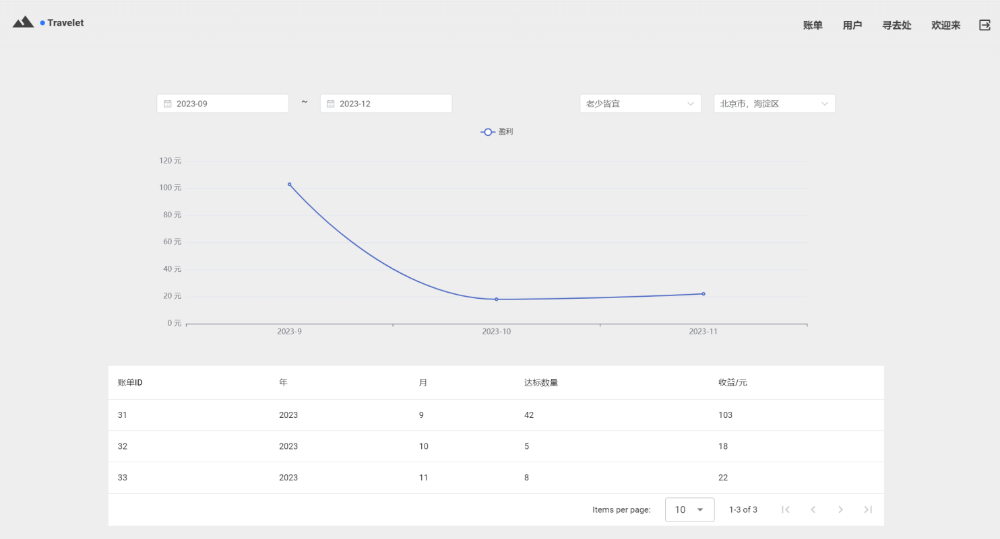

# Travelet

### '好去处'原型系统

**基于 `Vue3` + `Vuetify` 打造**

- 项目要求参阅 `docs/project.pdf`
- 最终汇报参阅 `docs/report.docx`
- 后端项目地址: [Travelet-Backend](https://github.com/BUPT-CS-Assignment/Travelet-Backend)

## Snapshot




## Setup

```
# yarn
yarn

# npm
npm install

# pnpm
pnpm install

# pnpm
bun install
```

### Compiles and hot-reloads for development

```
# yarn
yarn dev

# npm
npm run dev

# pnpm
pnpm dev

# bun
bun run dev
```

### Compiles and minifies for production

```
# yarn
yarn build

# npm
npm run build

# pnpm
pnpm build

# bun
bun run build
```

### Lints and fixes files

```
# yarn
yarn lint

# npm
npm run lint

# pnpm
pnpm lint

# bun
bun run lint
```

### Customize configuration

See [Configuration Reference](https://vitejs.dev/config/).
